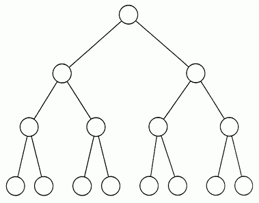

# Tree

## Structure

Trees act like linked lists, they have nodes and are connected by pointers. The difference of a tree than a linked list is that a tree is able to connect to many different nodes.

## Binary Tree


1. A binary tree always starts with a root node, which is the node that's on the top. 
2. The nodes that are not connected to other nodes are called leaf nodes.
3. A node that has any connected nodes are called parent nodes.
4. A node that is connected from a node on the top is called a child node to the parent node.
5. Nodes that have the same parent are called siblings.
6. The nodes to the left or right of the parent node consist a subtree.


## Binary Search Tree


Binary Search Tree are like the normal binary tree except one parent can only have two children.

## Caution


Have you ever wondered this before? If we don't well organize our tree then what it looks like?? It looks like a linked list right! So pretty much there is no need for tree huh? 

Below will show you how we are going to avoid this problem!!

## Balanced Tree


This looks so much better right? And it does look like a tree!
The idea of a balanced tree is simple. It means a binary tree in which the height of the left and right subtree of any node differ by not more than 1.

## Before we start to create the tree, we need to create node class

```csharp
public class Node {
    public int key;
    public Node left, right;

    // constructor
    public Node(int key)
    {
        this.key = key;
        left = null;
        right = null;
    }
}
```

## Insert data in the tree

```csharp
static void insert(Node temp, int key)
{
    if (temp == null) {
        root = new Node(key);
        return;
    }
    Queue<Node> q = new Queue<Node>();
    q.Enqueue(temp);

    while (q.Count != 0) {
        temp = q.Peek();
        q.Dequeue();

        if (temp.left == null) {
            temp.left = new Node(key);
            break;
        }
        else
            q.Enqueue(temp.left);

        if (temp.right == null) {
            temp.right = new Node(key);
            break;
        }
        else
            q.Enqueue(temp.right);
    }
}
```

## Remove data in the tree
```csharp
// This function allows us to delete the deepest value
static void deleteDeepest(Node root, Node delNode)
{
    Queue<Node> q = new Queue<Node>();
    q.Enqueue(root);

    Node temp = null;

    while (q.Count != 0) {
        temp = q.Peek();
        q.Dequeue();

        if (temp == delNode) {
            temp = null;
            return;
        }
        if (temp.right != null) {
            if (temp.right == delNode) {
                temp.right = null;
                return;
            }

            else
                q.Enqueue(temp.right);
        }

        if (temp.left != null) {
            if (temp.left == delNode) {
                temp.left = null;
                return;
            }
            else
                q.Enqueue(temp.left);
        }
    }
}

// This function allows us to delete any value in the tree
static void delete(Node root, int key)
{
    if (root == null)
        return;

    if (root.left == null && root.right == null) {
        if (root.key == key) {
            root = null;
            return;
        }
        else
            return;
    }

    Queue<Node> q = new Queue<Node>();
    q.Enqueue(root);
    Node temp = null, keyNode = null;

    while (q.Count != 0) {
        temp = q.Peek();
        q.Dequeue();

        if (temp.key == key)
            keyNode = temp;

        if (temp.left != null)
            q.Enqueue(temp.left);

        if (temp.right != null)
            q.Enqueue(temp.right);
    }

    if (keyNode != null) {
        int x = temp.key;
        deleteDeepest(root, temp);
        keyNode.key = x;
    }
}
```

## Recursion in the tree
We can use tree well doing with recursion. For example, when we are trying to find the fibonacci numbers, we can use tree and recursion to help us solve the problem.

## Efficiency

| Common BST Operation | Description                                                                                    | Performance |
|----------------------|------------------------------------------------------------------------------------------------|-------------|
| insert(value)        | Insert a value into the tree                                                                   | O(log n)    |
| remove(value)        | Remove a value from the tree                                                                   | O(log n)    |
| contains(value)      | Determine if a value is in the tree                                                            | O(log n)    |
| traverse_forward     | Visit all objects from smallest to largest                                                     | O(n)        |
| traverse_reverse     | Visit all objects from largest to smallest                                                     | O(n)        |
| height(node)         | Determine the height of a node. If the height of the tree is needed, the root node is provided | O(n)        |
| size()               | Return the size of the BST                                                                     | O(1)        |
| empty()              | Returns true if the root node is empty. This can also be done by checking the size for 0       | O(1)        |

## Example 
We are given different students IDs, and the teacher wants us to write a program to organiza them.

```csharp
public static void Main(String[] args)
{
    root = new Node(10);
    root.left = new Node(11);
    root.left.left = new Node(7);
    root.right = new Node(9);
    root.right.left = new Node(15);
    root.right.right = new Node(8);

    int key = 12;
    insert(root, key);

    Console.Write("Inorder traversal after insertion:");
    inorder(root); // 7 11 12 10 15 9 8 

    int key = 11;
    delete(root, key);

    Console.Write("Inorder traversal after insertion:");
    inorder(root); // 7 12 10 15 9 8 
}
```

## Problem to solve 
You are working for a compnay, and the mananger would like you to organize some of the employee id.

[check for solution](Program.cs) It starts from line 91

[Go back to the welcome page](welcome.md)
